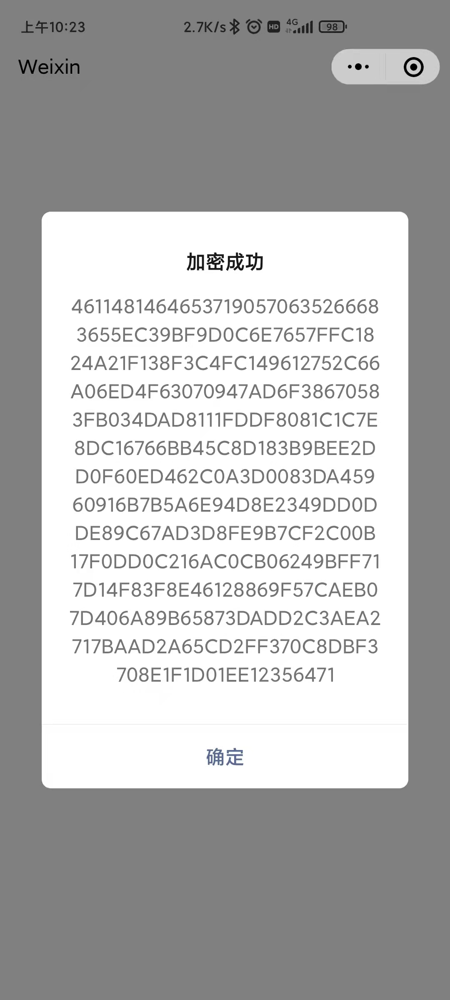
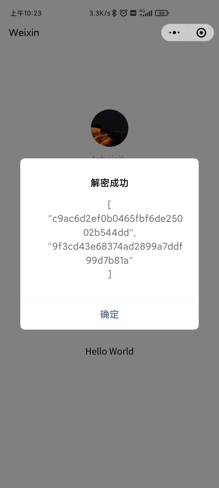

# xtjk-decrypt-mp

基于 [decrypt-core](https://github.com/JohnieXu/decrypt-core) 的微信小程序使用示例

## 截图

  
  
  

## QA

- Q：引入decrypt-core之后项目启动报错

  A：点击 `工具>npm>构建npm` 之后，需要手动拷贝 `node_module/crypto-js` 下所有文件到 `miniprogram_npm` 目录下，详见[这个问题](https://developers.weixin.qq.com/community/develop/doc/000e0aabea04c029a54da773d5c000?highLine=%2520%25E6%25B2%25A1%25E6%259C%2589%25E6%2589%25BE%25E5%2588%25B0%25E5%258F%25AF%25E4%25BB%25A5%25E6%259E%2584%25E5%25BB%25BA%25E7%259A%2584%2520NPM%2520%25E5%258C%2585%25EF%25BC%258C%25E8%25AF%25B7%25E7%25A1%25AE%25E8%25AE%25A4%25E9%259C%2580%25E8%25A6%2581%25E5%258F%2582%25E4%25B8%258E%25E6%259E%2584%25E5%25BB%25BA%25E7%259A%2584%2520npm%2520%25E9%2583%25BD%25E5%259C%25A8%2520%2560miniprogramRoot%2560%2520%25E7%259B%25AE%25E5%25BD%2595%25E5%2586%2585%25EF%25BC%258C%25E6%2588%2596%25E9%2585%258D%25E7%25BD%25AE%2520project.config.json%2520%25E7%259A%2584%2520packNpmManually%2520%25E5%2592%258C%2520packNpmRelationList%2520%25E8%25BF%259B%25E8%25A1%258C%25E6%259E%2584%25E5%25BB%25BA)
